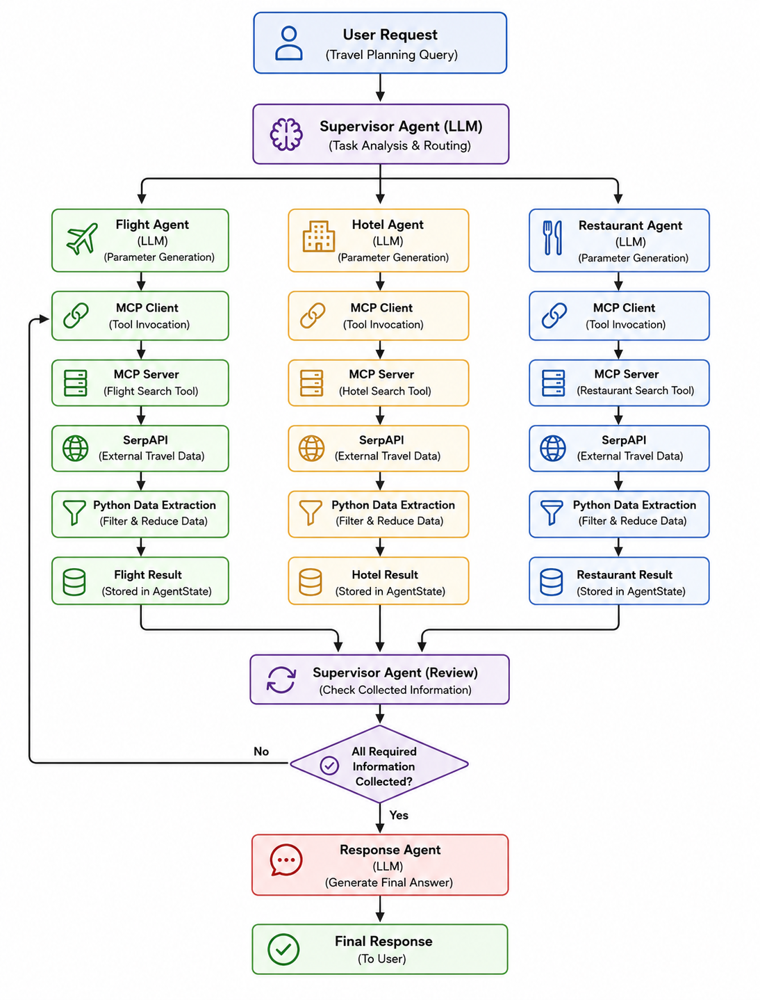
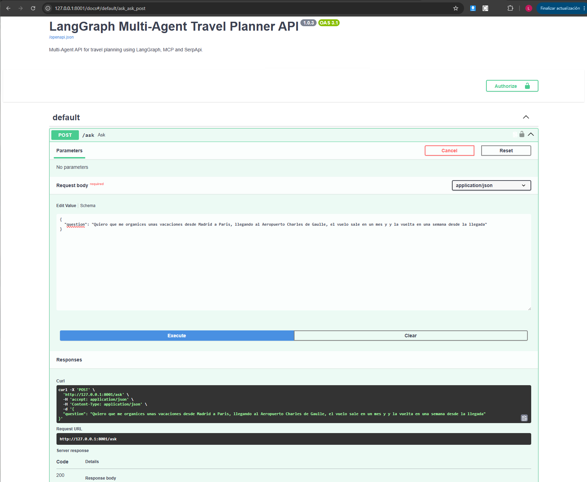
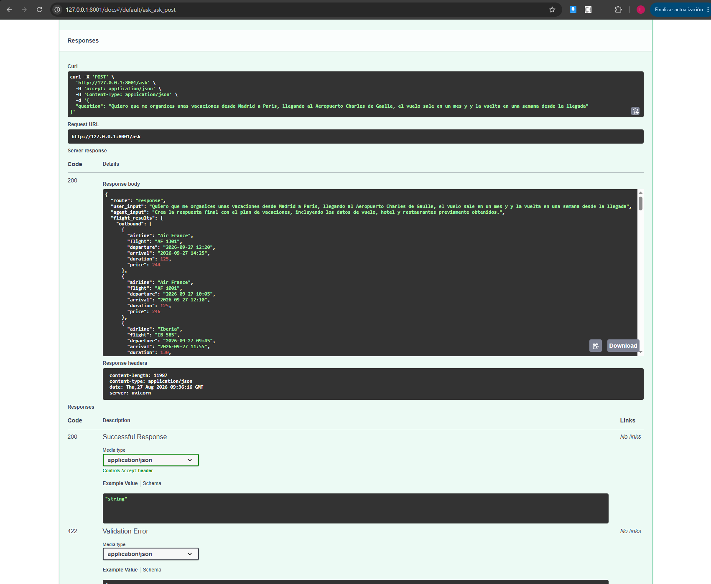
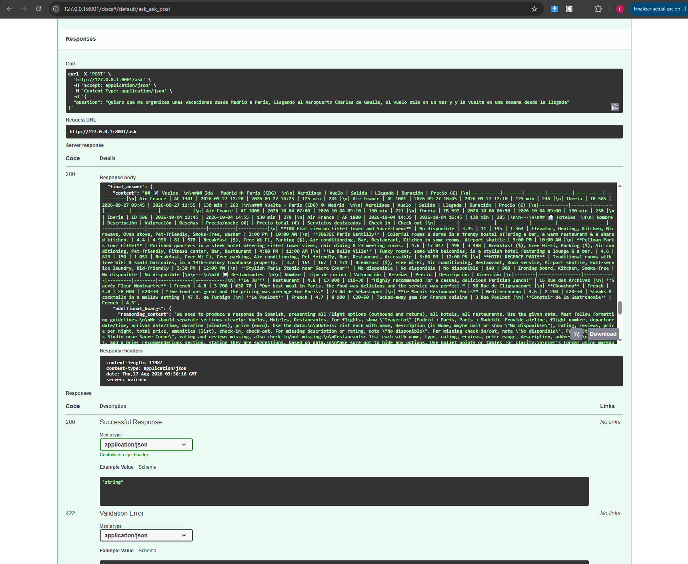

# LangGraph Multi Agent Travel Planner

## Project Overview

This project is a production focused Multi Agent AI system built with LangGraph for travel planning. It uses a supervisor based architecture to understand user requests, divide the required tasks, and coordinate specialized agents for flights, hotels, and restaurants.

The system combines LangGraph orchestration, LLM based reasoning, Model Context Protocol (MCP), and SerpAPI to retrieve external travel information.

Unlike a simple linear chatbot, the workflow dynamically decides which specialized agent should be executed and when enough information has been collected to generate the final response.

The project focuses on modular architecture, clear separation of responsibilities, structured state management, external tool integration, and practical Agentic AI design.

## Key Features

* Multi Agent travel planning workflow built with LangGraph
* Supervisor Agent for dynamic task routing
* Specialized Flight Agent
* Specialized Hotel Agent
* Specialized Restaurant Agent
* Response Agent for final answer generation
* LLM based parameter extraction for external tools
* Model Context Protocol (MCP) integration
* SerpAPI integration for external travel data
* Deterministic Python based data extraction and filtering
* Structured state management using Pydantic
* Asynchronous API communication using HTTPX and asyncio
* Modular prompt architecture
* Independent LLM wrapper
* Test suite for agents, nodes, MCP, SerpAPI, and graph execution

## Architecture

The system uses a Multi Agent architecture orchestrated by LangGraph.

Supervisor
Receives the user request, checks the workflow state, decides which agent should run next and generates the instructions for that agent.

Specialized Agents
Flight, Hotel and Restaurant agents interpret the instructions, generate the parameters required by the MCP tools and process the returned data.

MCP Layer
The MCP Client communicates with the MCP Server, which exposes the travel search tools and connects to SerpAPI.

Data Processing
Python extracts the relevant information from the API responses before storing it in the shared AgentState. This avoids unnecessary LLM calls and keeps the data structured.

Response Agent
Uses the collected information and the Supervisor instructions to generate the final response for the user.

Shared State
AgentState is shared across the workflow and contains the user request, routing information and processed results.

LLM Layer
Groq and LangChain ChatGroq are used for routing, reasoning and parameter generation.

## System Workflow



## Project Structure

```text
.
├── config.py
├── graph.py
├── main.py
├── requirements.txt
│
├── src/
│   ├── agents/
│   │   ├── flight_agent.py
│   │   ├── hotel_agent.py
│   │   ├── restaurant_agent.py
│   │   ├── response_agent.py
│   │   └── supervisor_agent.py
│   │
│   ├── api/
│   │   └── api.py
│   │
│   ├── auth/
│   │   └── auth.py
│   │
│   ├── llm/
│   │   └── model.py
│   │
│   ├── nodes/
│   │   ├── flight_node.py
│   │   ├── hotel_node.py
│   │   ├── restaurant_node.py
│   │   ├── response_node.py
│   │   └── supervisor_node.py
│   │
│   ├── prompts/
│   │   ├── flight_prompt.py
│   │   ├── hotel_prompt.py
│   │   ├── restaurant_prompt.py
│   │   ├── response_prompt.py
│   │   └── supervisor_prompt.py
│   │
│   ├── schemas/
│   │   ├── agent_state.py
│   │   └── supervisor_response.py
│   │
│   └── tools/
│       ├── mcp_client.py
│       └── mcp_server.py
│
└── test/
    ├── test_ddgs.py
    ├── test_graph_llm.py
    ├── test_langgraph.py
    ├── test_mcp_agent.py
    ├── test_mcp_client.py
    ├── test_mcp_server.py
    ├── test_nodes.py
    └── test_serpapi.py
```

## Tech Stack

* Python
* LangGraph
* LangChain
* Groq
* MCP
* SerpAPI
* Pydantic
* HTTPX
* asyncio
* FastAPI
* Docker

## API Demonstration







## MCP Integration

The project uses Model Context Protocol to separate the Agentic workflow from external travel services.

The specialized agents do not communicate directly with SerpAPI. Instead, they use an MCP Client to communicate with an MCP Server that exposes the required travel search tools.

This separation allows the external data sources and tools to remain independent from the reasoning and orchestration layers.

The current architecture uses MCP for travel related searches including flights, hotels, and restaurants.

## Data Processing Strategy

The LLM is used to understand the request and generate the parameters needed by the MCP tools.

After receiving the data from the external API, Python extracts the relevant information before storing it in the AgentState.

This avoids unnecessary LLM calls, reduces token usage, and keeps the data processing simple and predictable.

**Flow:**

External API → MCP Server → Python Extraction → AgentState

## Async Architecture

The application uses asynchronous programming for external communication.

HTTP requests are performed using HTTPX AsyncClient and asynchronous MCP operations are used where applicable.

Synchronous operations can be isolated from the event loop when required, allowing the main asynchronous workflow to continue without unnecessary blocking.

## Testing

The project includes tests covering the main components of the system.

The test suite includes:

* LangGraph workflow execution
* Graph and LLM integration
* Supervisor and node execution
* MCP Server
* MCP Client
* MCP Agent integration
* SerpAPI integration
* External search testing

These tests are used to validate the different layers independently during development.

## Key Design Decisions

* Explicit workflow orchestration using LangGraph
* Supervisor based dynamic routing
* Independent specialized agents for flights, hotels, and restaurants
* Shared AgentState across the workflow
* Structured data validation using Pydantic
* MCP used as the external tool integration layer
* External API communication separated from Agentic reasoning
* Deterministic Python data extraction instead of an additional LLM
* Reduced data stored in the shared state
* Independent prompts for each agent
* Asynchronous external communication
* Modular architecture for future expansion

## Future Extensions

The architecture has been designed to support future Agentic capabilities, including:

* Additional travel agents
* More external MCP tools
* Memory integration
* Human in the loop workflows
* Travel preference management
* Additional external travel providers
* More advanced planning capabilities

## Status

Production system available for live demonstration during interviews.

## Repository Note

Source code is private due to infrastructure and deployment constraints.
Full technical walkthrough and live demo are available upon request.

## Author

Leonardo Darrain Rocha  
Senior Software Engineer  
https://www.linkedin.com/in/leonardo-darrain-rocha-a6062354/  
